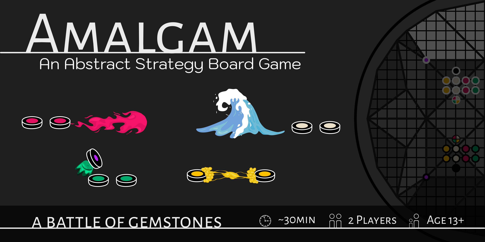

# Amalgam · `v0.01 (Development)`


A two player abstract strategy game that requires you to tactically utilize your pieces  in conjunction with one another to either eliminate the opponents pieces or carefully get a valuable piece to the other side of the board.

``` diff
# Current Status: Under Development
+ Playability: Single Player Against AI Bot (AI Logic not yet Implemented)
```

| Link | Details |
| -------- | --------- |
| [Join Our Discord](https://discord.gg/gKHjJNBWAd) | We hope to build a playtesting community to refine our game. Due to the very technical nature of the game, we believe we need as much playtesting as we can get in order to create balanced rules thatare also enjoyable to play. Additionally, the community will hopefully act as a way to find other players and share strategies. |
| [Rules Document](https://github.com/GreenAnts/Amalgam_Webgame/tree/main/assets/Rulebook) | As we iterate on the game and make changes to any of the rules, the newest version of the rules document can be found here.|
| [Website](https://www.amalgamboardgame.com/) | This is basically another way to read the rules, that are possibly more accessible. |
| [Tabletop Simulator](https://steamcommunity.com/sharedfiles/filedetails/?id=1402132394&searchtext=amalgam)  | A 3D tabletop experience as an alternative to SCREENTOP.GG - NOTE: The Tabletop Simulator Application is a paid software. |
| [Video Tutorial](https://youtu.be/LZD5h4siXVM) | Reading the rules not your thing? Or maybe you read the rules but you are still confused...Try watching the video walk through to get a better understanding. |
| [A short story of our journey so far](https://www.patreon.com/posts/amalgam-board-113134314?utm_medium=clipboard_copy&utm_source=copyLink&utm_campaign=postshare_creator&utm_content=join_link) |  Before starting back up on this project again, I wrote up a short article about our LONG journey of trying to make this game a reality. It's been about 10 years since I first designed the initial idea of this project, and hopefully it will soon finally become a reality!|
| [Board Game Geek (BGG) Page](https://boardgamegeek.com/boardgame/433428/amalgam) | Game listing on Board Game Geek - A well known website in the board game industry |


- - -

## The source code is Open Source under the GNU GPL Version 3 License.
### The boardgame and its accompanied assets within this repository are licensed under the Creative Commons Attribution 4.0 International. 
<a href="https://www.patreon.com/collection/787282?view=expanded">Amalgam Board Game</a> © 2026 by <a href="https://www.patreon.com/UnfinishedProjects">Anthony Davis</a> is licensed under <a href="https://creativecommons.org/licenses/by/4.0/">CC BY 4.0</a>


- - -

> While this is a personal pet project - I want it to be a community project. . . one that can evolve and adapt as more people get involved. I am sure some of the rules will need tweaking as players learn how to "break" the meta. And the hope is not only that the game will be played by others, but that the player base/community actually gets involved in improving the game, or even making rule variations for custom games, and etc. In short: "an open source, player contributed game, absolutely free and accessible for everyone"

- - -
### A Personal Note:
I’ve been working on this board game on and off for many years, but I’ve never managed to get a working digital version up and running that others could easily play online. This repository is my latest attempt to finally make that happen.

I’ve decided to open source the project and release the game under Creative Commons, in the hope that making it public might give it its best chance of becoming playable. While I wish my programming skills were sufficient to do this on my own, they’re not — and up to this point I’ve largely been relying on AI-assisted coding to get things moving.

I’m very aware that this kind of “vibe coding” isn’t the most efficient or maintainable way forward, but for now it’s the best option I have. If you’re a capable programmer, software engineer, or someone who enjoys untangling and improving early-stage projects, I would genuinely love your help in getting this game up and running. Any contributions, big or small, would be hugely appreciated.

And if coding isn’t your thing, or you’re not in a position to contribute code right now, that’s completely okay too. I’d still love it if you’d check out the game, share it with others who might be interested, or offer feedback on the gameplay and rules. Even just knowing what works, what doesn’t, or what feels confusing is incredibly helpful.
- - -

